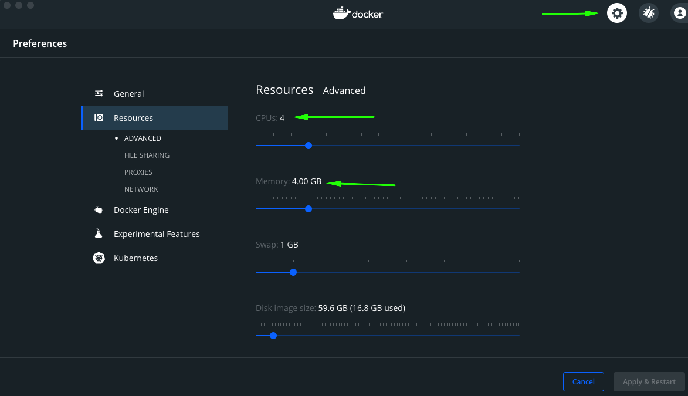

# Kubernetes Cluster

In order to run tests, we need a [Kubernetes](https://kubernetes.io/) (often abbreviated as *K8s*) cluster, and a way to connect to it (see [why Kubernetes](https://smartcontractkit.github.io/chainlink-testing-framework/setup/kubernetes.html#why)).

In order to connect to a K8s cluster, we need to [download kubectl](https://kubernetes.io/releases/download/). This will let you connect to and control any Kubernetes cluster.

Next you'll need to get a Kubernetes cluster running. If you're lucky, you'll have one running in the cloud somewhere that you can utilize. But if you don't, or just want to get something running locally, you can use [Docker](https://www.docker.com/) and [K3D](https://k3d.io/) to launch a local Kubernetes cluster.

<div class="note note-purple">
The Kubernetes setup process, and the resources needed to run a K8s cluster for these tests is a common pain point. We're exploring ways to lessen the resources needed, and possibly expand to other systems as well as Kubernetes.
</div>

## Local Kubernetes Cluster

First up, [install Docker](https://docs.docker.com/get-docker/) if you haven't already, then [install K3D](https://k3d.io/#installation). These two technologies will enable you to run a lightweight Kubernetes cluster on your machine quickly.

### Configure Docker

Docker will need a little more power than its default in order to run our tests, especially if we want to run many of them at once. In Docker Desktop, you can go to `Settings (the gear in the top right) -> Resources -> Advanced` to change how much power to give Docker. It will depend on your personal machine's specs, but a good starting point for some basic tests is 4CPUs and 4GB RAM.



### K3D Local Cluster

`k3d cluster create`

After a few minutes, the above command will deploy a local Kubernetes cluster on your machine! Use the below commands to check that things are working correctly.

```sh
> kubectl cluster-info
Kubernetes control plane is running at https://0.0.0.0:60887
CoreDNS is running at https://0.0.0.0:60887/api/v1/namespaces/kube-system/services/kube-dns:dns/proxy
Metrics-server is running at https://0.0.0.0:60887/api/v1/namespaces/kube-system/services/https:metrics-server:https/proxy
> kubectl get ns
NAME              STATUS   AGE
default           Active   114s
kube-system       Active   114s
kube-public       Active   114s
kube-node-lease   Active   114s
```

You can use the `kubectl` CLI to control and view the Kubernetes cluster if you're handy with it, and we'll be using those commands for simplicities sake. You can also use [Lens](https://k8slens.dev/), a handy GUI that simplifies things a bit. Use the below command to tear down the cluster.

`k3d cluster delete`

<div class="note note-yellow">
Not deleting your cluster when not in use means that it will continue to use up your machine's resources.
</div>
